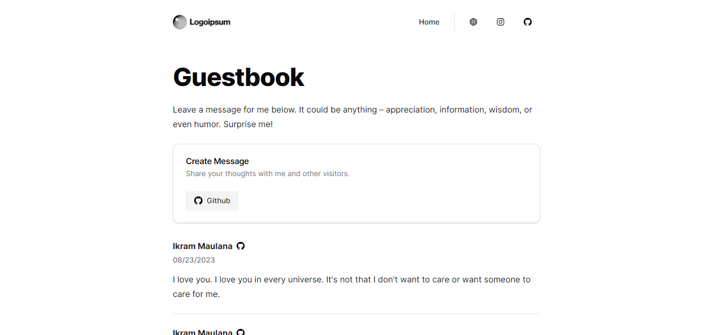

# Guestbook App

The guestbook app is a simple web application that allows you to create and view guestbook entries. This project bootstraped with [T3 App](https://create.t3.gg/) and implemented caching with [Redis](https://redis.io/).

Live example hosted on Vercel: https://guestbook-ikrammaulana.vercel.app



## 🔑 Getting Github Client ID and Secret

To get your Github Client ID and Secret, you need to create a Github OAuth app. You can follow the steps from [this guide](https://scribehow.com/shared/Getting_Github_Client_ID_and_Secret__KEf9Rk1FQtOzi5CaVFJxyA). then add your `GITHUB_CLIENT_ID` and `GITHUB_CLIENT_SECRET` to your `.env` file. Make sure to make separate Github Client ID and Secret for development and production environment.

## 📦 Getting Redis REST URL and Token

To get your Redis REST URL and Token, you can make a free account on [Upstash](https://console.upstash.com/). Then add your `UPSTASH_REDIS_REST_URL` and `UPSTASH_REDIS_REST_TOKEN` to your `.env` file.

## 🖥️ Running Locally

1. Clone this repository

   ```bash
   git clone https://github.com/Ikram-Maulana/guest-book.git
   ```

2. Install dependencies

   ```bash
   cd guest-book
   pnpm install
   ```

3. Add your environment variables to your `.env` file in the root of your project

   ```bash
   cp .env.example .env
   ```

4. Start the development server

   ```bash
   pnpm dev
   ```

5. Open [http://localhost:3000](http://localhost:3000) with your browser to see the result

## 🚀 Deploy on Vercel

1. Fork this repository

2. Create new project on [Vercel](https://vercel.com/)

3. Connect your repository to Vercel

4. Add your environment variables to your Vercel project

   ```bash
   DATABASE_URL=
   NEXTAUTH_SECRET=
   GITHUB_CLIENT_ID=
   GITHUB_CLIENT_SECRET=
   NEXT_PUBLIC_PORTFOLIO_URL=
   UPSTASH_REDIS_REST_URL=
   UPSTASH_REDIS_REST_TOKEN=
   ```

5. Deploy your project
